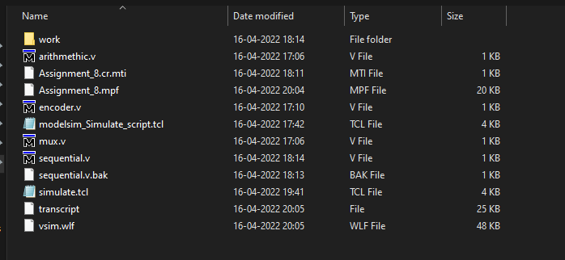
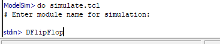
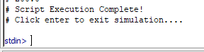

# Modelsim Simulation script

## Overview:
- TCL script to determine all the input ports of a module and force clock signals on each port in increasing powers of 2. (For Example, 100 ps,200 ps, 400 ps etc.)
- Script also checks if any of the input signals are named "clk". If found, the "clk" signal will be assignment the signal with highest frequency. (ie: 100 ps) 
- Script will then run the simulation.
- Finally, after the script completes execution, it will wait for user input to exit simulation.

## Usage:
- Copy the simulate.tcl script to project folder such it in present in the same folder as the verilog source files containing the modules to be simulated.
\

- Open the project in modelsim and run the scripy by typing "do simulate.tcl".
- User must then enter the name of the module to be simulated by the script.
\

- Script will then run, and the waveform will be visible in wave window if execution is successful.
- Once execution is completed, the script will wait for user input to exit simulation.
- User can press the "Enter" button on their keyboard to quit the simulation.
\

## TODO:
- Modulize the code by making use of procedure blocks